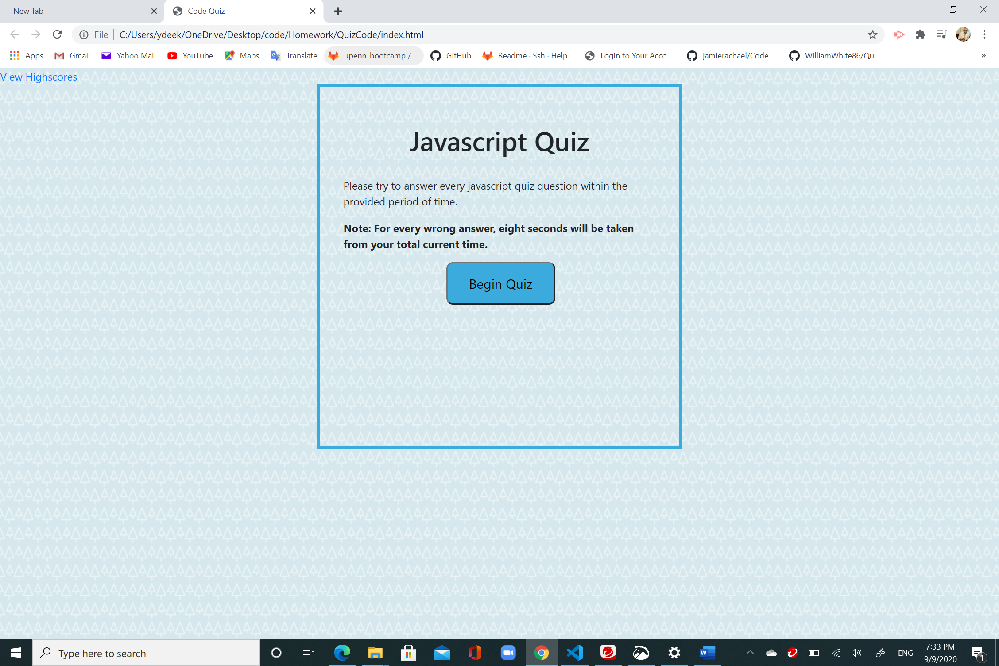
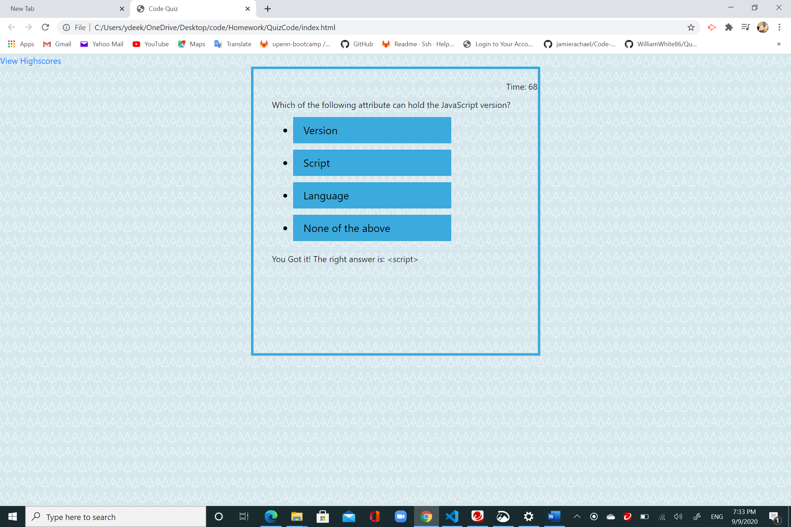
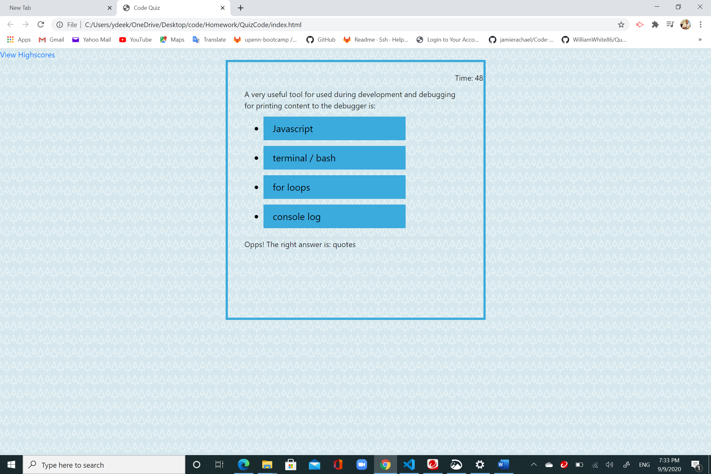
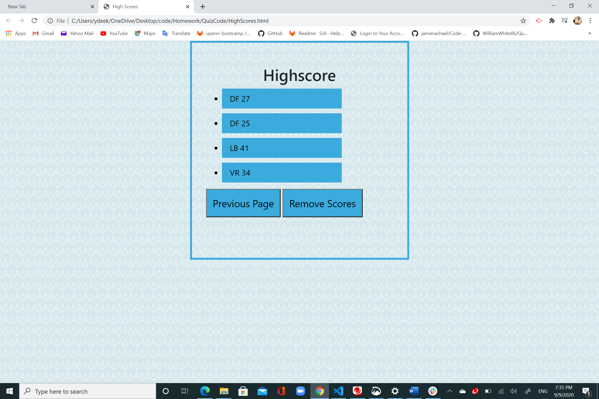
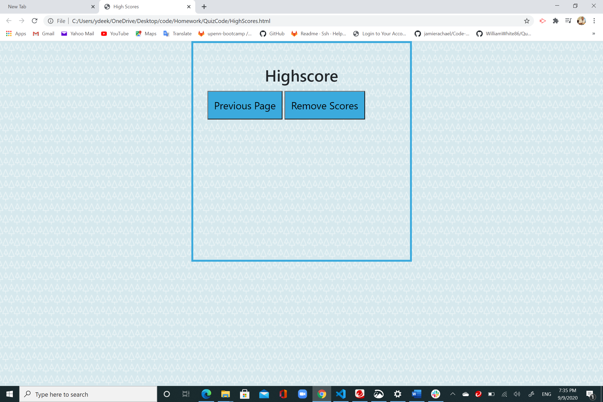

# Quiz Code

This the fourth homework assignment Penn PLS Coding Bootcamp. 
This code quiz application is created using HTML, CSS, and JavaScript. The quiz consists of seven timed questions related to JavaScript Language. Scores goe up with every correct answer, and eight seconds are deducted with every wrong answer. The scores are generated and can be seen in the results page, the final page. 

This assignment is deployed to Github page and the link of the application can be seen here: 

